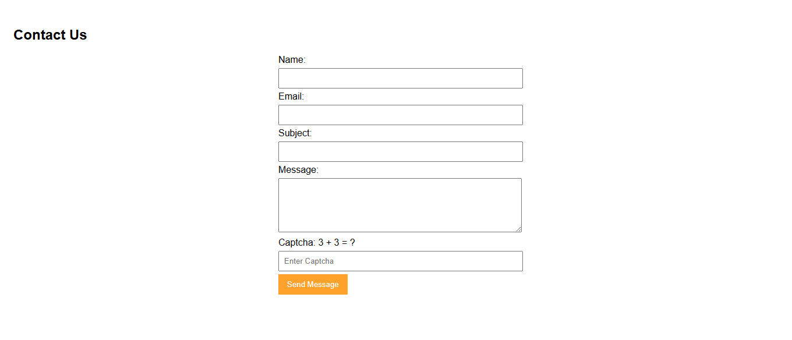

# PHP Contact Form

A simple contact form project built with **PHP** and **JavaScript**.  
This project demonstrates basic server-side form handling, validation, and client-side CAPTCHA verification.

---

## Features

- Contact form with name, email, subject, and message fields
- Client-side CAPTCHA implemented with JavaScript
- Server-side validation using PHP
- Messages stored in a text file on the server
- Runs on a local PHP server (XAMPP)

---

## Technologies Used

- HTML5
- CSS3
- JavaScript (Client-side validation & CAPTCHA)
- PHP (Server-side processing)

---

## How to Run the Project

Follow these steps to run the PHP Contact Form locally using XAMPP:

1. **Install XAMPP**  
   Download and install XAMPP if you don't have it already.

2. **Start Apache**  
   Open the XAMPP Control Panel and click **Start** next to Apache. Wait until it shows **Running**.

3. **Copy Project Folder**  
   Place the entire project folder (containing `index.html`, `captcha.js`, `process.php`, and `messages.txt`) into the `htdocs` directory of XAMPP.  
   Example path on Windows: C:\xampp\htdocs\contact-form

   
4. **Open in Browser**  
    Launch your browser and navigate to: http://localhost/contact-form/index.html

5. **Test the Form**  
    - Fill in all the fields.  
    - Enter the correct CAPTCHA displayed on the form.  
    - Click Send Message.

6. **Check Result**  
    - A success message should appear: **"Thank you! Your message has been saved."**  
    - The message will also be saved in the `messages.txt` file inside the project folder.

**Note:**  
    - PHP scripts will only run on a local server (XAMPP, WAMP, MAMP) or a live server with PHP support.  
    - Directly opening `index.html` will not execute PHP and may cause errors.

## Screenshots

Form view before submitting:

Message success after submitting:

